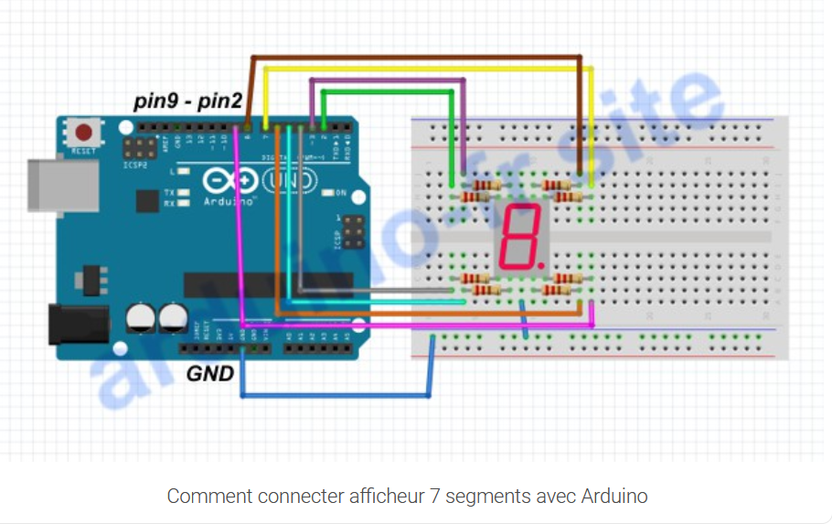

# PerColpaDiQualcuno

Write a program that displays, on a seven-segment one-digit display, a string passed from the serial monitor.

To understand the different types of resistor:
* <https://uk.rs-online.com/web/content/discovery/ideas-and-advice/resistors-guide>.

The tutorials I followed:
* <https://arduino-france.site/7-segments>;
*  <https://www.youtube.com/watch?v=tdexkAEfHg0>.
